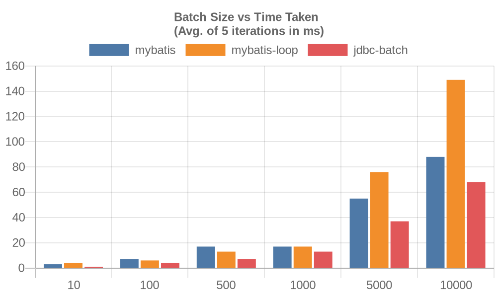
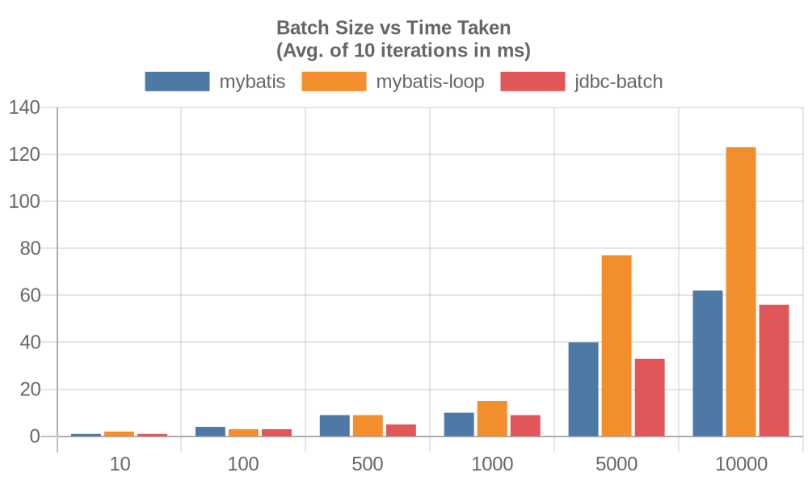
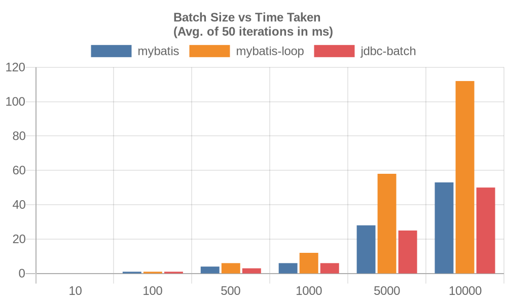
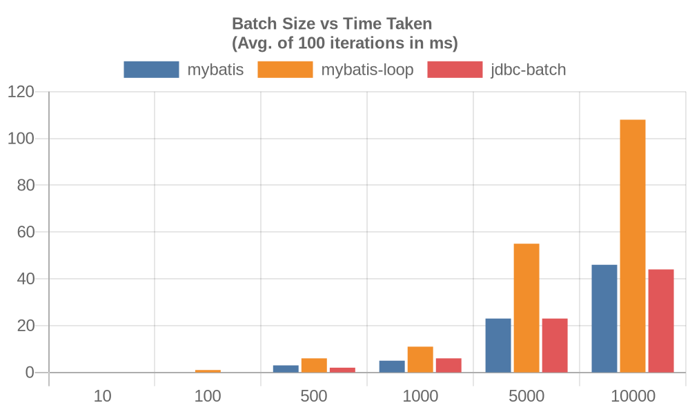

# MyBatis Batch Performance #

This is a toy benchmark to check the performance of a regular [MyBatis
insert](https://mybatis.org/mybatis-3/sqlmap-xml.html#insert_update_and_delete)
vs. a [MyBatis loop (multi-row)
insert](https://mybatis.org/mybatis-dynamic-sql/docs/insert.html#XML_Mapper_for_Multiple_Row_Insert_Statements)
& a raw JDBC batch insert.

The benchmark is created by repeatedly creating a `person` table with the following columns

| Column      | Type        |
|-------------|-------------|
| person_id   | int         |
| first\_name | varchar(50) |
| last\_name  | varchar(50) |
| occupation  | varchar(50) |

Where the `person_id` is an auto generated primary key. All 3
scenarios use the return generated key to fetch the inserted id field.

## Build & Run ##

Build & run the benchmark for different iterations

``` sh
mvn compile exec:java -Dexec.arguments=5
mvn compile exec:java -Dexec.arguments=10
mvn compile exec:java -Dexec.arguments=50
mvn compile exec:java -Dexec.arguments=100
```

## Sample Results ##






## Observations & Conclusions ##

It is observed from the sample results that JDBC batch is consistently
better than MyBatis regular & looped inserts. It is expected mainly
because the JDBC batch insert does not incur any framework
overhead. However, the looped insert out performs the regular insert
for batch sizes 500 & 1000 (except for the 100 iterations
case). Overall it seems that for most cases the regular MyBatis insert
is good enough ( for the toy benchmark :| atleast)
